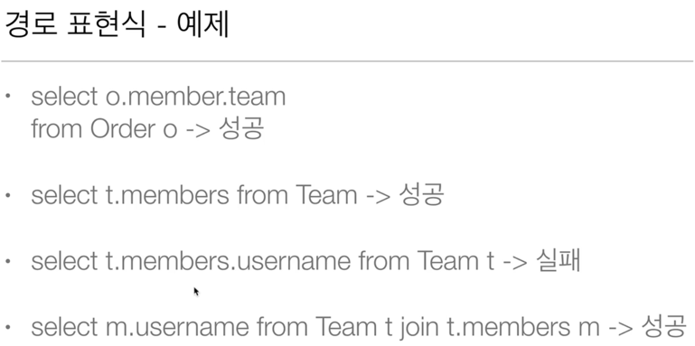

<div align="center">
    JPQL 기본 문법
</div>

#### JPQL
- `select m from Member m where m.age > 18`
- 엔티티와 속성은 대소문자 구분한다.
- JPQL 키워드는 대소문자 구분 안한다(select, from where..)
- 엔티티 이름 사용, 테이블 이름을 사용하지 않는다.
- 별칭은 필수

- TypeQuery
    - 반환 타입이 명확할 때 사용
  ```java
  TypedQuery<Member> query = em.createQuery("select m from Member m", Member.class);
  ```
- Query
    - 반환 타입이 명확하지 않을 때 사용
  ```java
  Query query2 = em.createQuery("select m.username, m.age from Member m");
  ```

- 결과 조회 API
    - query.getResultList()
        - 결과가 하나 이상일 때 리스트 반환
        - 결과가 없으면 빈 리스트 반환
    - query.getSingleResult()
        - 결과과 정확히 하나, 단일 객체 반환
        - 결과가 없으면 NoResultException
        - 둘 이사이면 NonUniqueResultException

#### 프로젝션
- select 절에 조회할 대상을 지정하는 것
- 프로젝션 대상: 엔티티, 임베디드 타입, 스칼라 타입(숫자, 문자 등 기본 데이터 타입)

- 프로젝션 - 여러 값 조회
- `select m.username, m.age from Member m`
  - Query 타입으로 조회
  ```java
  List resultList = em.createQuery("select m.username, m.age from Member m")
                            .getResultList();
  Object o = resultList.get(0);
  Object[] result = (Object[]) o;
  ```
  - Object[] 타입으로 조회
  ```java
   List<Object[]> resultList = em.createQuery("select m.username, m.age from Member m", Object[].class)
                    .getResultList();
  Object[] result = resultList.get(0);  
  ```
  - new 명령어로 조회
    - 단순 값을 DTO로 바로 조회
  ```java
  List<MemberDTO> resultList = em.createQuery("select new jpql.MemberDTO(m.username, m.age) from Member m", MemberDTO.class)
                    .getResultList();
  MemberDTO memberDTO = resultList.get(0);
  ```
  
#### 페이징 API
- JPA는 페이징을 다음 두 API로 추상화
- setFirstResult(int startPosition)
  - 조회 시작 위치
- setMaxResults(int maxResult)
  - 조회할 데이터 수

#### 조인
- 내부 조인
- 외부 조인
- 세타 조인

#### 서브 쿼리
- 서브 쿼리 한계
  - JPA는 where, having 절에서만 서브 쿼리 사용 가능
  - from 절의 서브 쿼리는 현재 JPQL에서 불가능
    - 조인으로 풀 수 있으면 풀어서 해결

#### JPQL 타입 표현
- 문자: '헬로'
- 숫자: 10L(Long), 10D(Double), 10F(Float)
- Boolean: TRUE, FALSE
- ENUM: enum 클래스의 패키지명까지 모두 적어줘야 함
- 엔티 타입: TYPE(m) = Member (상속 관계에서 사용)

#### JPQL 기본 함수
- CONCAT
- SUBSTRING
- TRIM
- LOWER, UPPER
- LENGTH
- LOCATE
- ABS, SQRT, MOD
- SIZE, INDEX(JPA 용도)

- 사용자 정의 함수 호출
  - 하이버네이트는 사용 전 방언에 추가해야 한다.

#### 경로 표현식
- 상태 필드(state field)
  - 단순히 값을 저장하기 위한 필드
- 연관 필드(association field)
  - 연관관계를 위한 필드
  - 단일 값 연관 필드
    - @ManyToOne, @OneToOne, 대상이 엔티티
  - 컬렉션 값 연관 필드
    - @OneToMany, @ManyToMany, 대상이 컬렉션
- 경로 표현식 특징
  - 상태 필드: 경로 탐색의 끝(`m.username`에서 더 탐색 불가)
  - 단일 값 연관 경로: 묵시적 내부 조인 발생, 탐색 더 가능(`select m.team from Member m`은 team을 조회하기 위해 내부 조인이 묵시적으로 발생한다. 이는 조심해서 사용해야 하는 이유다.)
  - 컬렉션 값 연관 경로: 묵시적 내부 조인 발생, 더 탐색 불가



- 경로 탐색을 사용한 묵시적 조인 시 주의사항
  - 항상 내부 조인
  - 컬렉션은 경로 탐색의 끝, 명시적 조인을 통해 별칭을 얻어야 함
  - 경로 탐색은 주로 select, where 절에서 사용하지만 묵시적 조인으로 인해 SQL의 FROM절에 영향을 줌
- 가급적 묵시적 조인 대신에 명시적 조인을 사용하는 것을 추천한다.
  - 묵시적 조인은 조인 시 일어나는 상황을 하눈에 파악하기 어렵다.
  - 조인은 SQL 튜닝에 중요한 포인트이다.

#### 패치 조인(fetch join)
- SQL 조인 종류가 아니다.
- JPQL에서 성능 최적화를 위해 제공하는 기능
- 연관된 엔티티나 컬렉션을 SQL 한 번에 함께 조회하는 기능
- join fetch 명령어 사용

#### 컬렉션 패치 조인
- 일대다 관계에서 패치 조인

#### 패치 조인과 일반 조인의 차이
- JPQL은 결과를 반환할 때 연관관계 고려하지 않는다.
- 단지 select 절에 지정한 엔티티만 조회한다.
- 패치 조인을 사용할 때만 연관된 엔티티도 함께 조회(즉시 로딩)
- 패치 조인은 객체 그래프를 SQL 한 번에 조회하는 개념

#### 패치 조인의 특징과 한계
- 패치 조인 대상에는 별칭을 줄 수 없다.
- 둘 이상의 컬렉션은 패치 조인을 할 수 없다.
- 컬렉션을 패치 조인하면 페이징을 사용할 수 없다.
  - 일단 모든 데이터를 읽은 후 메모리에서 페이징을 하므로 위험하다.

#### Named 쿼리 - 정적 쿼리
- 미리 정의해서 이름을 부여해두고 사용하는 JPQL
- 정적 쿼리
- 애플리케이션 로딩 시점에 초기화 후 재사용
- **애플리케이션 로딩 시점에 쿼리를 검증할 수 있다.**


